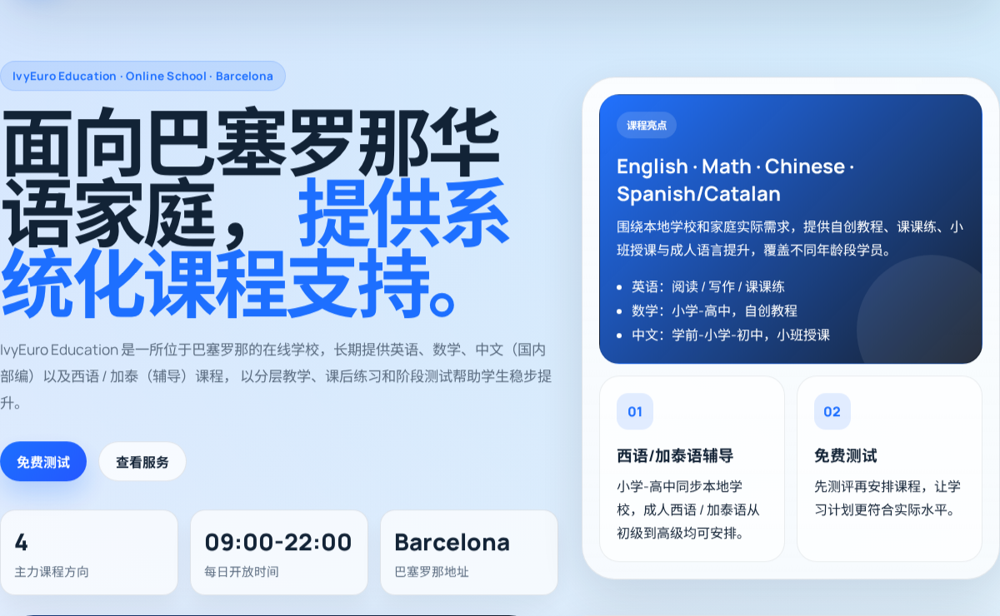
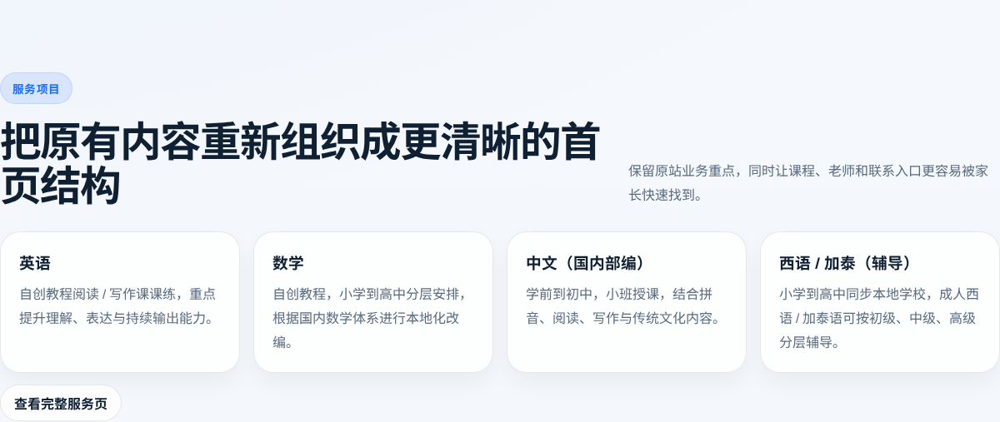

# IvyEuro Education 网站改造分析报告

## 一、项目背景

IvyEuro Education 原站内容以教育培训业务为主，核心信息包括英语、数学、中文、西语 / 加泰辅导、课程表、家长反馈、新闻动态和联系方式。但原始页面结构偏旧，信息分散，移动端体验和视觉层次较弱，不利于招生咨询与长期内容更新。

## 二、改造目标

- 保留原站核心业务内容
- 将单页/碎片化内容整理为多页面官网结构
- 提升品牌识别度、页面转化效率和移动端体验
- 为后续持续更新课程、新闻、师资和活动内容预留扩展空间

## 三、改造结果

### 1. 页面结构重建

已将网站重构为完整的多页面站点：

- 首页
- 服务项目
- 关于我们
- 老师简介
- 课程表
- 家长好评
- 新闻动态
- 新闻详情
- 联系我们

### 2. 内容迁移与整理

已从旧站和归档材料中整理并迁移以下核心信息：

- 机构名称：IvyEuro Education
- 城市：Barcelona
- 地址：Plaça de la Universitat, 3, Planta 6ª, 08007 Barcelona
- 电话：+34-625-627-022 / 0034-625627022
- 营业时间：每天 09:00-22:00
- 课程方向：英语、数学、中文、西语 / 加泰辅导、法语、编程 AI
- 暑期课程表：2026 暑期班课程安排
- 联系方式：二维码已纳入页面

### 3. 视觉与体验升级

- 首页改为更适合招生转化的首屏结构
- 增加学校场景图与课程视觉区
- 课程表以大图预览形式展示
- 新闻栏目升级为“头条 + 列表 + 详情”结构
- 全站导航统一，并支持当前页高亮
- 页面在桌面端和移动端均采用响应式布局

## 四、网站优势

### 优势 1：信息结构更清晰

将原先分散的信息整合为统一的导航与页面层级，家长可以快速找到课程、师资、课程表和联系方式。

### 优势 2：更适合招生转化

首页加入了免费测试、服务项目、课程亮点、联系入口等模块，能更直接引导咨询与报名。

### 优势 3：更符合机构官网形态

页面风格由“内容展示页”升级为“正式招生官网”，整体更专业，也更便于后续持续运营。

### 优势 4：更利于后续扩展

当前结构支持继续补充：

- 老师详情页
- 新闻文章页
- 课程详情页
- 活动公告
- 学员案例

## 五、改造截图

### 首页首屏与品牌展示

### 网站优势与课程结构

## 六、当前状态

- 站点已完成本地预览和内容整合
- 站点已同步到 GitHub 仓库
- 当前仓库地址：
  - `https://github.com/guoyunyi0417-hue/ivy-euro-education.git`

## 七、后续建议

1. 补充真实老师资料、课程文案和新闻内容
2. 增加更多实拍图片或品牌素材
3. 在上线前再做一次 SEO、页面标题和元信息检查
4. 根据需要选择 GitHub Pages、Vercel 或其他静态部署方案
